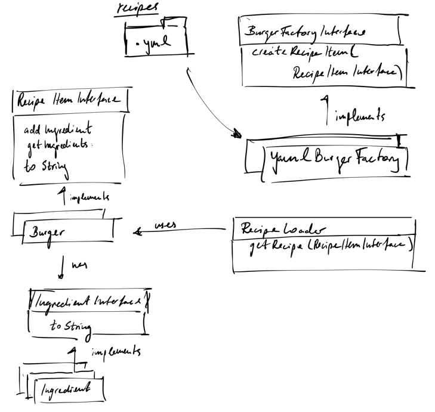

# Burger Recipe App
This is a simple Burger Recipe App

- recipes are loaded from .yml in the data folder.
- available recipes can be listed with `php public/index.php burger:list`
- recipe for a given burger can be printed out by  `php public/index.php burger:recipe:hamburger`

# Design

# What I would have done if I had more time
- complete Ingredient collection
- support more colors
- more validation, parsing html files
- Tests - for RecipeItem, Ingredients, Color Validation
- I would try to make the Ingredient class more flexible, maybe using one single class but with a parent child relation for types.